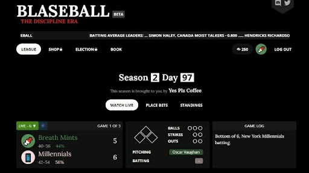

# Demo Homework: Radio Baseball

In mid-2020, while professional sports were offline, a group of enthusiastic out-of-work programmers created Blaseball, a surreal baseball simulation. 



(If you’re curious, you can read more about Blaseball on the wiki: https://www.blaseball.wiki/w/Blaseball)

Your task in this assignment is to create your own baseball simulation, which can be as realistic (or not) as you like.

Your program should include:
* A class modeling a Player who has a String name and a String position, which is either “batter” or “pitcher.”
* A class modeling a Team with a name, a city and an internal array of 8 batters and 4 pitchers.
* A method Team.AddPlayer(Player) which adds a player to the team’s array of players.
* A class modeling a Field which stores the players on each of three bases.
* A class modeling a Game with two Teams, and integers representing the inning, balls, strikes and outs.
* A method Game.atBat(Player) which simulates a player at bat (you can simulate this however you want).
* A method Game.inning(Team) which runs through the Team’s batters until the game has a strike count of 3.

These simulations should print messages about what is happening, similar to a radio sports announcer.

For example, a possible output would be:

```
The Philly Pies are playing the Yellowstone Magic
Top of the first inning
Clove Mahle is up to bat
Strike
Ball
Strike
Hit! Groundball
Clove Mahle runs to first base
Will Statter Jr. is up to bat
```
and so on.
